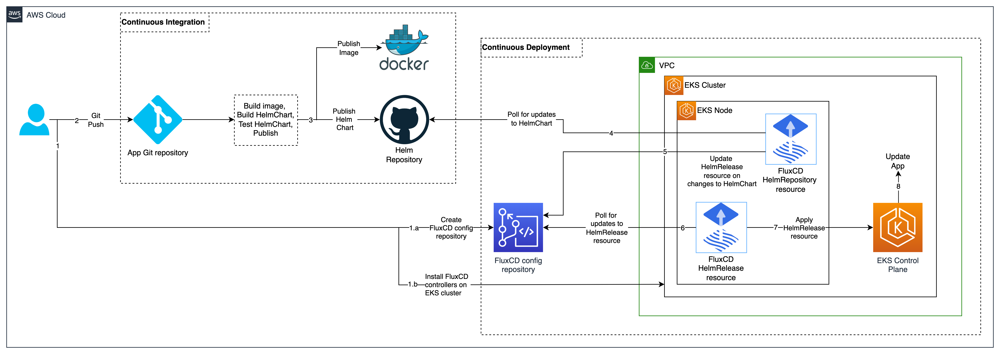

# Continuous Deployment of Helm Charts on Amazon EKS using FluxCD V2 and AWS CodeCommit
This project illustrates continuous deployment of Helm chart for a sample NodeJs application on an EKS Cluster using FluxCD V2. 
FluxCD uses GitOps principles to keep the EKS cluster resources in sync with the application’s Helm chart.
Updates published to the application’s Helm chart are continuously synced by FluxCD to the EKS cluster.

# Architecture


# Folder structure
```
.
├── README.md                           <-- This documentation file
├── eks-cluster-cdk                     <-- CDK for deploying a EKS cluster
├── nodejs-webservice                   <-- Sample nodejs webserver packaged as a container
├── node-redis-example-app              <-- Sample K8S app packaged as Helm chart with nodejs webserver and redis backend
├── config                              <-- configuration params
└── docs                                <-- architecture diagram 
```

# Pre-reqs
* Install kubectl, iam_authenticator
* HTTPS Git credentials for CodeCommit
* Install helm v3
* Github account

# Product Versions
* Helm V3
* FluxCLI V2
* kubectl V1.21
* EKS V1.21
* NodeJS V1.17
* Docker V1.21
* ECR V1.21

# 1. Create EKS cluster; Create CodeCommit repository for FluxCD config
  ```shell
  # Use region us-west-2
  aws configure --profile default
      
  # Create EKS cluster
      
  # Install kubectl, iam_authenticator, 
  cd eks-cluster-cdk
  npm i
  cdk deploy
      
  # Create a CodeCommit repository = helmcd-flux-config-repo
  aws codecommit create-repository --repository-name helmcd-flux-config-repo --profile default
      
  # https://git-codecommit.us-west-2.amazonaws.com/v1/repos/helmcd-flux-config-repo
  ```

# 2. Install FluxCD CLI, deploy FluxCD on EKS cluster
* #### 2.1 Install Flux CLI
    ```shell script
    brew install flux
    ```

* #### 2.2 Check pre-requisites on EKS cluster
    ```shell script
    flux check --pre
    ```

* #### 2.3 Configure FluxCD on EKS - bootstrap
    ```shell script
    # This step is called bootstrapping the EKS cluster with FluxCD configuration. 
    # This step will first write the FluxCD config files to the CodeCommit repo. 
    # Then the FluxCD configuration is installed on the EKS cluster in the namespace flux-system. 
    flux bootstrap git \
      --url=https://git-codecommit.us-west-2.amazonaws.com/v1/repos/helmcd-flux-config-repo \
      --username=Admin-at-8732 \
      --password=1/Lypk1BKAxhsvGNvmzelDc= \
      --token-auth=true \
      --path=clusters/helmcd-cluster
    ```

* #### 2.4 Verify FluxCD pods are running
    ```
    kubectl get pods --namespace flux-system
    ```

# 3. Create Helm Chart repository

* #### 3.1 Create a github repo named app-helm-charts
    ```shell script
    git clone https://github.com/$GITHUB_USER/app-helm-charts.git
    cd app-helm-charts
    ```
* #### 3.2 In the github repo, create a branch named = gh-pages
    ```shell script
    git checkout -b gh-pages
    # Github automatically exposes contents of the "gh-pages" branch as a Helm Chart repository available at https://$GITHUB_USER.github.io/app-helm-charts
    
    touch index.yaml
    git add index.yaml
    git commit -a -m "add index.yaml"
    git push -u origin gh-pages
    ```

# 4. Create and upload Helm Chart to the Helm Chart repository

* #### 4.1 Build and push image to dockerhub
    ```shell script
    cd nodejs-webservice
    npm i
    docker build -t ${username}/testnodeapp:v1 .
    docker login
    docker push
    ```

* #### 4.2 Create Helm chart for the application
    ```shell script
    # Create Helm Chart
    # helm create node-redis-example-app
    
    # Add templates, update Chart.yaml
    helm package node-redis-example-app
    mv node-redis-example-app-0.1.0.tgz ./app-helm-charts/
    ```

* #### 4.3 Upload Helm chart to Helm Repository
    ```shell script
      
    # Generate index.yaml 
    helm repo index app-helm-charts/ --url https://$GITHUB_USER.github.io/app-helm-charts
  
    # Commit and push index.yaml, packaged chart
    git commit -a -m "change index"
    git push origin
  
    # Verify the new index.yaml is being served from helm repo
    curl https://gree-gorey.github.io/helm-example/index.yaml
    ```

# 5. Configure FluxCD for continuous deployment of your Helm chart 

* #### 5.1 Clone the CodeCommit repository to your local
    ```shell script
    git clone https://git-codecommit.us-west-2.amazonaws.com/v1/repos/helmcd-flux-config-repo
    cd helmcd-flux-config-repo
    ```

* #### 5.2 Create K8S namespace into which the test application will be deployed
    ```shell script
    kubectl create namespace testns
    ```

* #### 5.3 Create helm repo source CRD for the source repository
    ```shell script
    mkdir ./clusters/helmcd-cluster/app2
  
    flux create source helm my-app-charts \
      --url=https://$GITHUB_USER.github.io/app-helm-charts \
      --interval=1m \
      --export > ./clusters/helmcd-cluster/app2/podinfo-helm-repo.yaml
    ```
      
* #### 5.4 Create custom resource of type HelmRelease which describes the helm chart to monitor
    ```shell script
    flux create hr helm-podinfo \
      --interval=2m \
      --source=HelmRepository/my-app-charts \
      --chart=node-redis-example-app \
      --chart-version=0.1.1 \
      --target-namespace=testredis3-helm \
      --export > ./clusters/helmcd-cluster/app2/podinfo-helm-chart.yaml
    ```
  
* #### 5.5 Commit and push flux config
    ```shell script
    git commit -m "adding helmrelease crd for my app"
    git push
  
    #Watch for application pods deployment 
    watch kubectl get pods --namespace testns
    ```

* #### 5.6 Verify V1 version of the application is deployed
    ```shell script
    # port forward to 3000 on nodejs webservice 
    kubectl port-forward ${app-podname} -n testns 8081:3000
    curl http://localhost:8081/hello
    ```

# 6. Push a new revision of your Helm chart and verify continuous deployment 

* #### 6.1 Update the app to change the hello message, build and push to docker
    ```shell script
    docker build -t ${username}/testnodeapp:v2 .
    docker push
    ```
  
* #### 6.2 Change template yaml, Chart.yaml in the local chart folder
    ```shell script
    docker build -t ${username}/testnodeapp:v1 .
    ```

* #### 6.3 Package and build a new chart
    ```shell script
    helm package node-redis-example-app
    mv node-redis-example-app-0.1.1.tgz ./app-helm-charts/
    ```
  
* #### 6.4 Push new chart to the Helm repo
    ```shell script
    # Generate index.yaml 
    helm repo index app-helm-charts/ --url https://$GITHUB_USER.github.io/app-helm-charts
      
    # Commit and push index.yaml, packaged chart
    git commit -a -m "change index"
    git push origin
      
    # Verify the new index.yaml is being served
    curl https://gree-gorey.github.io/helm-example/index.yaml
  
    #Watch for application pods deployment 
    watch kubectl get pods --namespace testns
    ```

* #### 6.5 Verify V2 version of the application is deployed
    ```shell script
    kubectl port-forward ${podname} -n testns 8081:3000
    curl http://localhost:8081/hello
    ```
